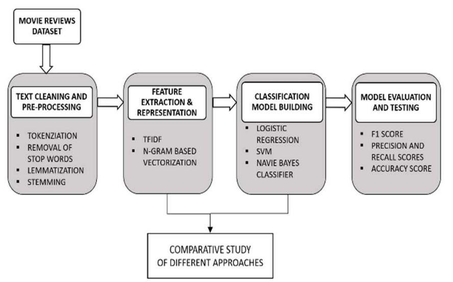
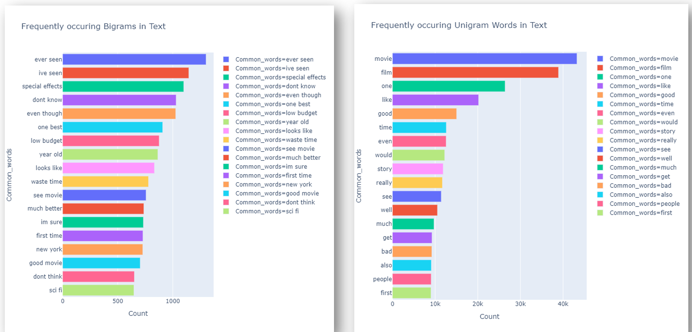
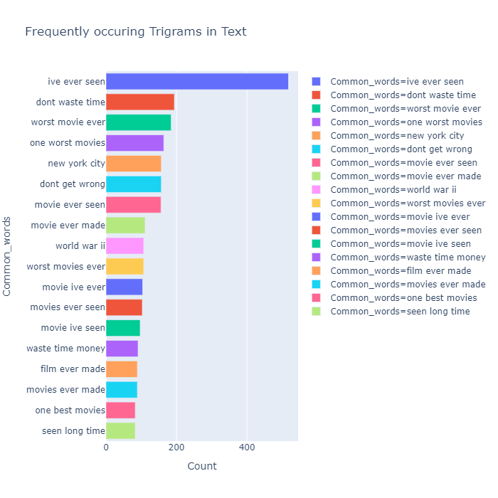
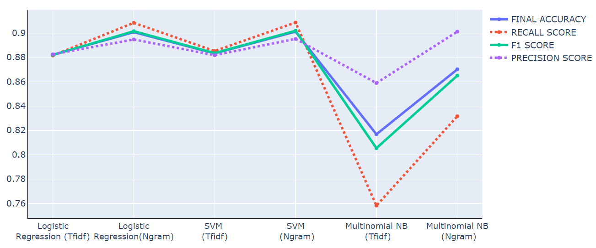
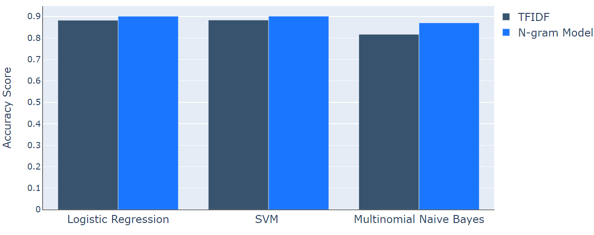

# ML_sentiement_analysis
##  Sentiment Analysis using Machine learning techniques

The aim of this project is to experiment with 
different machine learning approaches to classify dataset of 
IMDb movie reviews to perform sentiment analysis. Three 
different classifiers are used in this study which are: Logistic 
Regression, SVM and Naïve Bayes. The purpose of using 
different classifiers is to check for the best performances. The 
dataset includes movie reviews of 50,000 movies from IMDb. To 
improve the performance of our system additional features 
selection techniques, such as stemming, lemmatization, n-gram 
model, tokenization, and removal of stop words are applied. The 
performance of the system was evaluated using different metrics 
such as Final Accuracy, F1 Score, Recall Score and Precision 
Score. The proposed system achieved a maximum of 90% 
accuracy.
### Implementation Flow diagram

### Dataset
The dataset used in this project is issued by the Stanford 
Artificial Intelligence Laboratory. They have collected the 
raw data from the IMDb website. They have provided a set of 
50,000 reviews in total, the 50,000 reviews consist of 25,000 
movie reviews for training and 25,000 for testing.The 
dataset provided on their website is divided into two folders 
train and test, which serve as training data and testing data 
respectively.
### Visuslaization of data based on N-grams used.
In this project, three different kinds of N-grams - Unigram, Bigrams, Trigrams have been 
used in the classification to compute accuracies and generate 
different results.

### Results obtained by Comparative Study of the various classifiers based on various evaluation metrics used
The usage of N-gram model gives better results than TFIDF approach but it is to be noted 
that the N-gram approach requires more training time relatively.
Among all the variety of approaches used n-gram 
approach with n-gram range of 1 to 3 in combination with 
SVM approach has given best results with an accuracy score 
of 0.9011 which in terms of percentage is 90.11% and 
performed better in comparison to the results obtained from 
other approaches.
 
